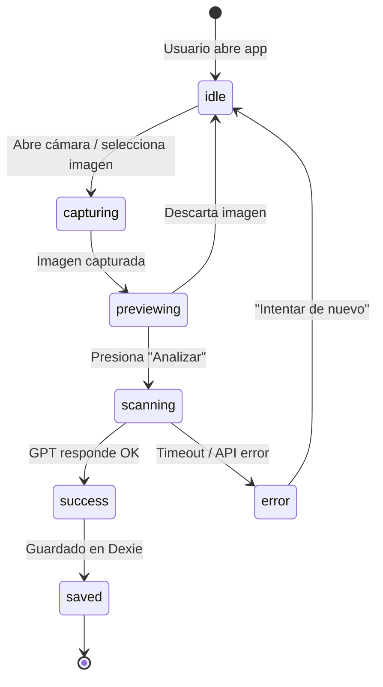
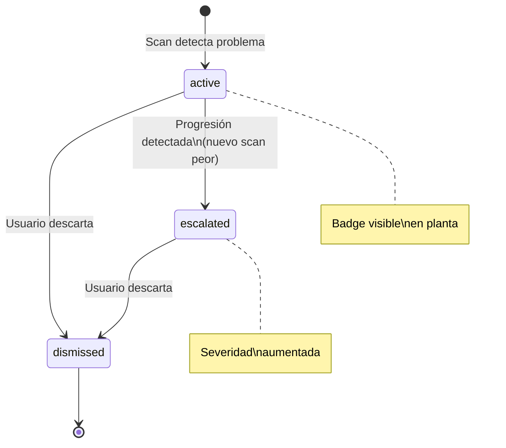

# Diagramas de Estados

Propósito: ciclos de vida de entidades clave. Actualizar solo si cambian reglas de negocio.

## Scan (ciclo de vida)

```mermaid
stateDiagram-v2
    [*] --> idle: Usuario abre app
    idle --> capturing: Abre cámara / selecciona imagen
    capturing --> previewing: Imagen capturada
    previewing --> idle: Descarta imagen
    previewing --> scanning: Presiona "Analizar"
    scanning --> success: GPT responde OK
    scanning --> error: Timeout / API error
    error --> idle: "Intentar de nuevo"
    success --> saved: Guardado en Dexie
    saved --> [*]
```

## Alert (ciclo de vida)

```mermaid
stateDiagram-v2
    [*] --> active: Scan detecta problema
    active --> dismissed: Usuario descarta
    active --> escalated: Progresión detectada\n(nuevo scan peor)
    escalated --> dismissed: Usuario descarta
    dismissed --> [*]

    note right of active: Badge visible\nen planta
    note right of escalated: Severidad\naumentada
```
