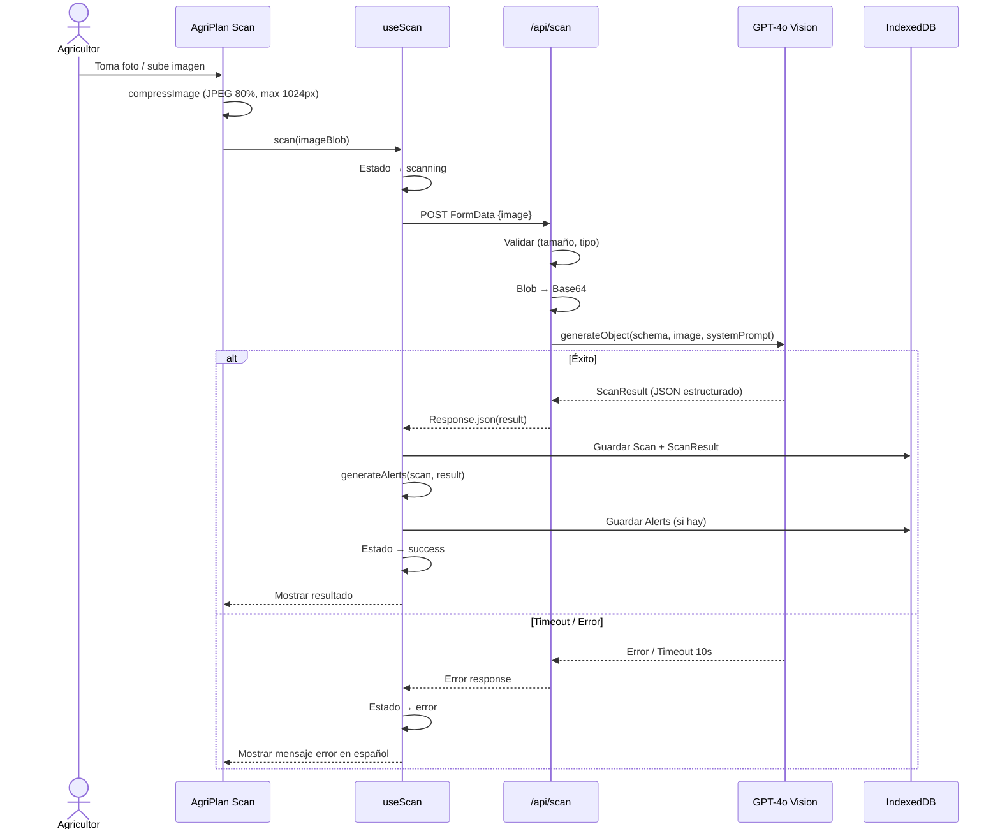
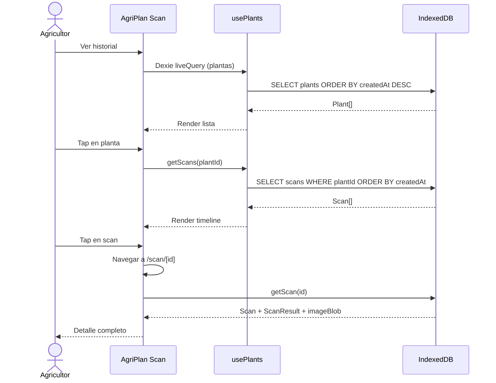
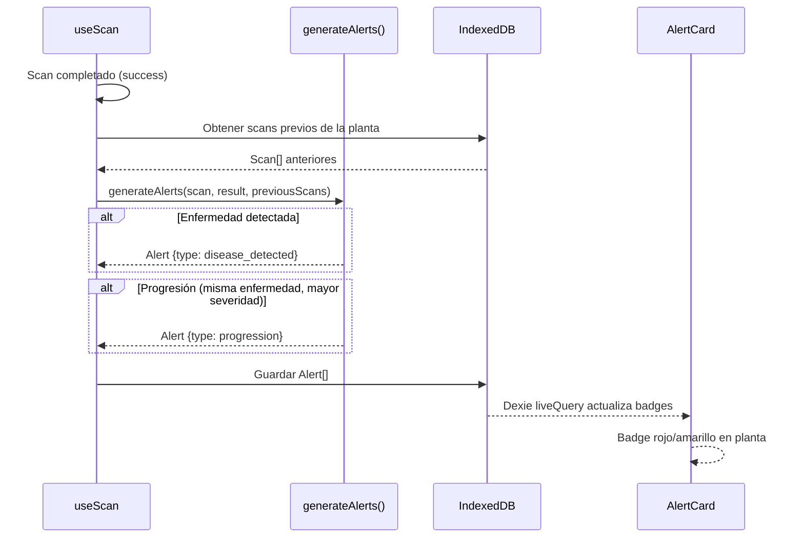

# Diagramas de Secuencia

Propósito: contratos críticos de interacción. Actualizar solo si cambia el flujo de negocio.

## Flujo 1: Escanear planta (MVP — online)

## Flujo 2: Gestionar plantas e historial

## Flujo 3: Alertas automáticas

